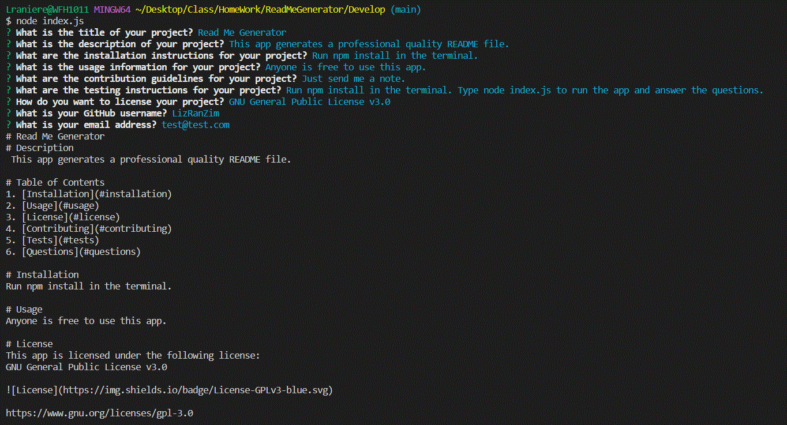
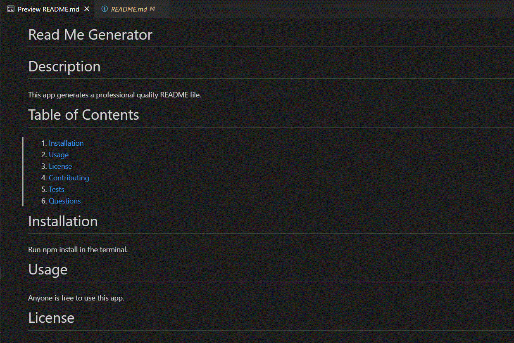
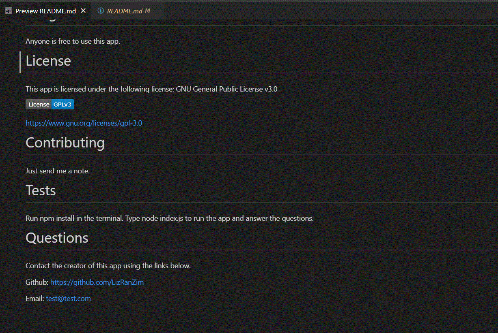

## ReadMeGenerator

The name of the application is ReadMeGenerator.

The application is a ReadMe markdown file generator based on user inputs for title, description, installation instructions, usage information, contribution guidelines, testing instructions, choice of license, and contact details for questions.

This a command line application.

## Mockup

The following .gifs shows the application's appearance and functionality.

## Link to video of application running

<a href="https://drive.google.com/file/d/1ne7OeAWVmo1UWyvONzOhmd9gLqQB4WjX/view">
Watch Read Me Generator on Google Drive</a>

## Link to GitHub code respository for application

<a href="https://github.com/LizRanZim/ReadMeGenerator">
https://github.com/LizRanZim/ReadMeGenerator</a>

